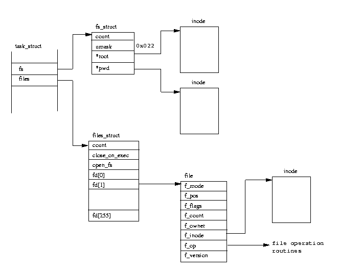

# ماجرا چیه؟
دارم یچی یاد می‌گیرم که نیاز دارم مدام لینوکس رو خراب کنم که بتونم بفهمم توی اون چیز چه خبره. برای داشتن لینوکس از [UTM] استفاده کردم که بتونم یه نسخه از اوبونتو رو روی مک داشته باشم. راه دیگه‌اش استفاده از داکر بود ولی برای اینکه هر بار بتونم فرش ماجرا رو از سر بگیرم مجبورم که کانتینر رو پاک کنم و دوباره بسازمش که خب برای هر تغییر کوچیک یذره وقت‌گیره. این شد که یه تلاش قدیمی یادم اومد که می‌خواستم بفهمم چطور داکر کار می‌کنه و تصمیم گرفتم یه ابزار بنویسم برای این منظور. شبیه داکره ولی قراره برای این کرم ریختن راحت‌تر باشه و هر دستوری رو بهش می‌دیم ران کنه روی کرنل و تلاش کنه چیزی رو خراب نکنه.

## کلاً قراره چیکار کنم؟
فرض می‌کنم داکری وجود نداره. کاری که می‌خوام بکنم اینه که 
1. یه پروسه رو ران کنم که بعداً میشه پروسه‌ای که می‌خوام، 
2. فایل‌سیستم رو مختص اون کنم اینطور خراب‌کاری‌ها روی یه کرنل که من میگم اتفاق می‌افته، 
3. پروسه رو محدود به همون کرنل کنم، یعنی بقیه پروسه‌ها رو نبینه، 
4. صاحب نتورک و دم و دستگاه خودش باشه، 
5. استفاده از ریسورس رو محدود کنم که اگه چیزدستی کردم سیستم فریز نشه 
6. و در نهایت تغییراتم رو در لایه‌ای بالاتر از فایل‌سیستم اعمال کنم که بتونم راحت بپرونمش و برم جلو.

در واقع این پست و پنج پست بعدی در مورد این کار خواهند بود.

## می‌ارزه؟
نمی‌دونم ولی حال میده. و اینکه همه‌ی ماجرا قراره داخل [گیت] داکور :)) باشه.

# پروسه
## تو این پست قراره چیکار کنم؟
قرار شد یه برنامه داشته باشم که یه برنامه‌ی دیگه‌ای رو داخل لینوکس اجرا کنه و هر غلطی هم کرد، خود لینوکس آسیبی نبینه. پس در این پست قراره اساساً ببینم برنامه چیه، چطور ران میشه و چطور میشه داخل یه برنامه، یه برنامه‌ی دیگه اجرا کرد. همین.

## پروسه چیه؟
هر برنامه‌ی در حال اجرا در لینوکس یه [پروسه]‌ست. لینک، کامل ماجرا رو گفته (مخصوصاً بخش ۴.۶ گفته چی میشه وقتی یه پروسه ران میشه و بهش خیلی زود بر می‌گردیم) ولی اینجا برای جلو رفتن همون که عکس ۴.۲ (عکس زیر) رو ببینیم کافیه.



از `task_struct` پوینتر پایینی به یه `files_struct` اشاره می‌کنه که از فیلد ۴ به بعد فایل دیسکریپتورها (که از این به بعد بهشون FD یا فد میگم) شروع میشن. از اونجا که [تو لینوکس تقریباً همه چی فایله](https://unix.stackexchange.com/a/141020/115038)، FDها رایج‌ترین راه ارتباطی برنامه‌ی ما با تقریباً هر چیزی در جهان بیرون اون برنامه‌ن و از بین اونها هم ۳ تا فد اول معنای خاصی دارن: ورودی (اندیس صفر)، خروجی (اندیس ۱) و خطا (اندیس ۲). 

در واقع هر پروسه قبل از شروع، سه تا فد باز داره و این بر می‌گرده به فلسفه‌ی یونیکس برای عملی کردن ایده‌ی ترکیب ابزارهای مختلف با هم برای ساختن یه ابزار بزرگتر. هر ابزار بدون اینکه نیاز داشته باشه اطلاعی از ابزار دیگه داشته باشه، از فد صفر می‌خونه، خروجی رو تو فد یک می‌نویسه و خطاها به فد دو می‌رن.

یعنی در دستوری مثل `cat file | head -n 10` فد صفر دستور `head` میشه فد یک دستور `cat` یا در دستور `dosomething 2>&1` فد خطا (۲) میره به فد ۱ که همون خروجی باشه و اینطور میشه خروجی و خطا رو با هم تو یه فایل ریخت مثلاً (`dosomething 2>&1 > log` که در نهایت فد یک میشه فایل `log`). خالی از لطف نیست گفتن اینکه وقتی یه پروسه، پروسه‌ی جدید می‌زاد، جدول فدهای مادر رو به ارث می‌بره و اینطوریه که وقتی چندتا ابزار مختلف رو داخل چندتا بش فایل مختلف ترکیب می‌کنیم و اون بش فایل‌ها رو با هم ترکیب می‌کنیم، در نهایت می‌تونیم لاگ همه رو داخل یه فایل بریزیم.

## اولین برنامه
از اونجا که تا ته این سری پست‌ها ما قراره شل ران کنیم، پس برای شروع یه تیکه کد می‌زنیم که شل رو ران کنه:
```go
cmd := exec.Command("/bin/sh")  
cmd.Run()
```
اگه این برنامه رو داخل گو ران کنیم، هیچی نمیشه. چرا هیچی نمی‌شه؟ به صورت مشخص ما اینجا شل رو ران کردیم. شل وقتی ران میشه، اگه آرگومان نداشته باشه، تابع `isatty` رو روی فد ورودی کال می‌کنه (که میشه با `man 3 isatty` منوالش رو دید)، اگه ۱ برگرده یعنی FD یه ترمیناله و منتظر ورودی میشه، اگه صفر باشه، یعنی در حالت غیرمحاوره‌ای ران شده و فقط دستور رو ران می‌کنه و خارج می‌شه.

اما اگه فانکشن `exec.Command` رو ببینیم، فدهای خروجی نیلن و در ساخته شدن پروسه به `/dev/null` مپ میشن. برای دیدن این رفتار میشه تریس سیس‌کال‌ها رو دید:
```shell
meysam@ubuntu:~/www/test/go/dockor$ strace -f -e openat ./dockor
openat(AT_FDCWD, "/sys/kernel/mm/transparent_hugepage/hpage_pmd_size", O_RDONLY) = 3
strace: Process 43345 attached
strace: Process 43346 attached
[pid 43344] --- SIGURG {si_signo=SIGURG, si_code=SI_TKILL, si_pid=43344, si_uid=1000} ---
[pid 43344] --- SIGURG {si_signo=SIGURG, si_code=SI_TKILL, si_pid=43344, si_uid=1000} ---
strace: Process 43347 attached
strace: Process 43348 attached
[pid 43344] openat(AT_FDCWD, "/dev/null", O_RDONLY|O_CLOEXEC) = 3
[pid 43344] openat(AT_FDCWD, "/dev/null", O_WRONLY|O_CLOEXEC) = 7
[pid 43344] openat(AT_FDCWD, "/dev/null", O_WRONLY|O_CLOEXEC) = 8
[pid 43344] --- SIGURG {si_signo=SIGURG, si_code=SI_TKILL, si_pid=43344, si_uid=1000} ---
strace: Process 43349 attached
[pid 43349] openat(AT_FDCWD, "/etc/ld.so.cache", O_RDONLY|O_CLOEXEC) = 3
[pid 43349] openat(AT_FDCWD, "/lib/aarch64-linux-gnu/libc.so.6", O_RDONLY|O_CLOEXEC) = 3
[pid 43349] +++ exited with 0 +++
[pid 43347] --- SIGCHLD {si_signo=SIGCHLD, si_code=CLD_EXITED, si_pid=43349, si_uid=1000, si_status=0, si_utime=0, si_stime=0} ---
[pid 43347] +++ exited with 0 +++
[pid 43348] +++ exited with 0 +++
[pid 43346] +++ exited with 0 +++
[pid 43345] +++ exited with 0 +++
+++ exited with 0 +++
```
در دستور بالا `f` برای فالو کردن فورک‌ها و `e` برای فیلتر کردن بر اساس سیس‌کال‌ها استفاده شده. طریقه‌ی خوندنش هم اینطوریه که اول اسم سیس‌کال میاد و تو پرانتز آرگومان‌هاش میان. یه مساوی و خروجی. اگه خروجی منفی یک باشه، نشونه‌ی خطا در اجراست و جلوش خطا رو می‌نویسه. جزئیات دستور رو میشه با `man strace` دید.

همونطور که می‌بینیم ۳تا فد به نال باز شدن. فد نال برای فد صفر پروسه‌ی ما که در اینجا شله، توسط `isatty` یه ترمینال محاوره‌ای شناخته نمیشه و دستوری هم که بهش ندادیم و پس همینجا ماجرا تموم میشه.

برای حل این مشکل هم نیازه که ۳تا فد پروسه‌ای که ران می‌کنیم رو به فایل دیسکریپتورهای پروسه‌ی جاری خودمون وصل کنیم:
```go
cmd := exec.Command("/bin/sh")  
  
cmd.Stdin = os.Stdin  // <- ورودی استاندارد: فایل دیسکریپتور صفر
cmd.Stdout = os.Stdout  // <- خروجی استاندارد: فایل دیسکریپتور یک
cmd.Stderr = os.Stderr  // <- خطای استاندارد: فایل دیسکریپتور دو
  
cmd.Run()
```
و ران کردن این کد باحاله:
```shell
meysam@ubuntu:~/www/test/go/dockor$ go build .
meysam@ubuntu:~/www/test/go/dockor$ ./dockor
$ ls -lah
total 2.2M
drwxr-xr-x  7 meysam meysam   224 Feb 26 20:16 .
drwxr-xr-x  4 meysam dialout  128 Feb 26 17:38 ..
-rwxrwxr-x  1 meysam meysam  2.2M Feb 26 20:17 dockor
drwxr-xr-x 12 meysam meysam   384 Feb 26 20:17 .git
-rw-r--r--  1 meysam meysam    25 Feb 26 16:16 go.mod
-rw-r--r--  1 meysam meysam   276 Feb 26 19:46 main.go
$ ps aux | head -n 4
USER         PID %CPU %MEM    VSZ   RSS TTY      STAT START   TIME COMMAND
root           1  0.0  0.6  22200 12508 ?        Ss   Feb24   0:40 /sbin/init
root           2  0.0  0.0      0     0 ?        S    Feb24   0:00 [kthreadd]
root           3  0.0  0.0      0     0 ?        S    Feb24   0:00 [pool_workqueue_release]
$ cat /root
cat: /root: Permission denied
$ cat /root 2>/dev/null
```
ما کد رو ران کردیم، برامون شل رو باز کرد، چندتا دستور واقعی بهش دادیم و خروجی هم گرفتیم. تو دستور آخر هم فد خطا رو دادیم به نال که نتیجه‌اش این شد که خطا رو چاپ نمی‌کنه. خب خوبه. تا اینجا هر چند خیلی تفاوتی با شل بیرون از محیط احساس نمی‌کنیم، ولی اگه یه سری تغییر ریز دیگه داخل کدمون بدیم، به جایی رسیدیم که می‌تونیم هر دستور شلی رو داخل محیط خودمون ران کنیم:
```go
var argv []string  
if len(os.Args) > 1 {  
    argv = append([]string{"-c"}, os.Args[1:]...)  
}  
cmd := exec.Command("/bin/sh", argv...)  
  
cmd.Stdin = os.Stdin  
cmd.Stdout = os.Stdout  
cmd.Stderr = os.Stderr  
  
cmd.Run()
```

```shell
meysam@ubuntu:~/www/test/go/dockor$ ./dockor ls
dockor	go.mod	main.go
```

## چی شد که این شد؟
بخش ۴.۶ لینک [پروسه] توضیح میده که از صفر چه اتفاقی می‌افته که پروسه‌ی مادر شروع میشه و سیستم شروع به کار می‌کنه و در اون بین از دوتا مکانیزم نام می‌بره: clone و fork. 

برای فهمیدن ماجرای کلون و فورک داخل شل لینوکس میشه چپتر ۲ منوال رو که مال سیستم کال‌هاست رو دید، یعنی `man 2 clone` و `man 2 fork`. از منوال فورک میشه فهمید وقتی یه پروسه فورک میشه، یه پروسه عین پروسه‌ی والد در اون لحظه ساخته میشه و میره برای اسکجولینگ. منوال کلون هم میگه که مثل فورکه ولی یه سری تظریف داره که بعداً بهش بر می‌گردیم و در نهایت در انتهای منوال فورک هم به سیس‌کالی به اسم `execve` می‌رسیم که شبیه فورکه ولی بهمون این امکان رو میده که کلاً یه برنامه‌ی دیگه رو شروع به اجرا کنیم. 

بد نیست اگه سیس‌کال‌ها رو تریس کنیم:
```shell
meysam@ubuntu:~/www/test/go/dockor$ strace -f -e clone,fork,execve ./dockor ls
execve("./dockor", ["./dockor", "ls"], 0xffffd4962350 /* 25 vars */) = 0
clone(child_stack=0x4000026000, flags=CLONE_VM|CLONE_FS|CLONE_FILES|CLONE_SIGHAND|CLONE_THREAD|CLONE_SYSVSEMstrace: Process 43553 attached
) = 43553
[pid 43552] clone(child_stack=0x400005c000, flags=CLONE_VM|CLONE_FS|CLONE_FILES|CLONE_SIGHAND|CLONE_THREAD|CLONE_SYSVSEMstrace: Process 43554 attached
) = 43554
[pid 43552] --- SIGURG {si_signo=SIGURG, si_code=SI_TKILL, si_pid=43552, si_uid=1000} ---
[pid 43552] --- SIGURG {si_signo=SIGURG, si_code=SI_TKILL, si_pid=43552, si_uid=1000} ---
[pid 43552] clone(child_stack=0x4000058000, flags=CLONE_VM|CLONE_FS|CLONE_FILES|CLONE_SIGHAND|CLONE_THREAD|CLONE_SYSVSEMstrace: Process 43555 attached
) = 43555
[pid 43554] clone(child_stack=0x4000094000, flags=CLONE_VM|CLONE_FS|CLONE_FILES|CLONE_SIGHAND|CLONE_THREAD|CLONE_SYSVSEMstrace: Process 43556 attached
) = 43556
[pid 43555] clone(child_stack=0x4000090000, flags=CLONE_VM|CLONE_FS|CLONE_FILES|CLONE_SIGHAND|CLONE_THREAD|CLONE_SYSVSEMstrace: Process 43557 attached
) = 43557
[pid 43552] clone(child_stack=NULL, flags=CLONE_VM|CLONE_VFORK|SIGCHLDstrace: Process 43558 attached
 <unfinished ...>
[pid 43558] execve("/bin/sh", ["/bin/sh", "-c", "ls"], 0x400007e410 /* 25 vars */ <unfinished ...>
[pid 43552] <... clone resumed>)        = 43558
[pid 43558] <... execve resumed>)       = 0
[pid 43552] --- SIGURG {si_signo=SIGURG, si_code=SI_TKILL, si_pid=43552, si_uid=1000} ---
[pid 43558] clone(child_stack=0xffffc55d82a0, flags=CLONE_VM|CLONE_VFORK|SIGCHLDstrace: Process 43559 attached
 <unfinished ...>
[pid 43559] execve("/usr/bin/ls", ["ls"], 0xb4518bee05f0 /* 25 vars */ <unfinished ...>
[pid 43558] <... clone resumed>)        = 43559
[pid 43559] <... execve resumed>)       = 0
dockor	go.mod	main.go
[pid 43559] +++ exited with 0 +++
[pid 43558] --- SIGCHLD {si_signo=SIGCHLD, si_code=CLD_EXITED, si_pid=43559, si_uid=1000, si_status=0, si_utime=0, si_stime=0} ---
[pid 43558] +++ exited with 0 +++
[pid 43552] --- SIGCHLD {si_signo=SIGCHLD, si_code=CLD_EXITED, si_pid=43558, si_uid=1000, si_status=0, si_utime=0, si_stime=0} ---
[pid 43557] +++ exited with 0 +++
[pid 43553] +++ exited with 0 +++
[pid 43556] +++ exited with 0 +++
[pid 43555] +++ exited with 0 +++
[pid 43554] +++ exited with 0 +++
+++ exited with 0 +++
```

پروسه با کلون شدن dockor ران میشه و اون وسط مسطا احتمالاً چندتا پروسه برا gc و اینا ران میشه که بعد می‌رسه به `sh` و در نهایت هم به `ls`. 

## چیه اینا؟
دوتا سیس‌کال هست که داخل `strace` بالا خیلی تکرار شدن و در موردشون هم صحبت کردم. `execve` که پارامترهاش اسم برنامه‌ایه که می‌خوام ران کنم و آرگومان‌هاش. دومی هم `clone` که یه پارامتر `flags` داره. به جزئیات در پست ۳ بر می‌گردم ولی برای الان اگه لاگ بالا رو خلوت کنم به اینطور چیزی می‌رسم:
```shell
meysam@ubuntu:~/www/test/go/dockor$ strace -f -e clone,fork,execve ./dockor ls
1. execve("./dockor", ["./dockor", "ls"], 0xffffd4962350 /* 25 vars */) = 0
2. [pid 43552] clone(child_stack=NULL, flags=CLONE_VM|CLONE_VFORK|SIGCHLDstrace: Process 43558 attached
3. [pid 43558] execve("/bin/sh", ["/bin/sh", "-c", "ls"], 0x400007e410 /* 25 vars 
4. [pid 43558] clone(child_stack=0xffffc55d82a0, flags=CLONE_VM|CLONE_VFORK|SIGCHLDstrace: Process 43559 attached
5. [pid 43559] execve("/usr/bin/ls", ["ls"], 0xb4518bee05f0 /* 25 vars */ 
6. dockor	go.mod	main.go
7. [pid 43559] +++ exited with 0 +++
8. [pid 43558] --- SIGCHLD {si_signo=SIGCHLD, si_code=CLD_EXITED, si_pid=43559, si_uid=1000, si_status=0, si_utime=0, si_stime=0} ---
9. [pid 43558] +++ exited with 0 +++
10. [pid 43552] --- SIGCHLD {si_signo=SIGCHLD, si_code=CLD_EXITED, si_pid=43558, si_uid=1000, si_status=0, si_utime=0, si_stime=0} ---
11. +++ exited with 0 +++
```
اول هر خط اومدم دستی یه شماره خط اضافه کردم که بشه راحت بهشون رفرنس داد. تو خط ۱ با سیس‌کال `evecve` برنامه ران میشه. همونطور که قبلاً گفتم و تو منوال ۲ این سیس‌کال اومده، موقع اجرای این سیس‌کال، برنامه با برنامه‌ی قبلی جایگزین می‌شه کلاً، این یعنی یه پروسه‌ی جدید ایجاد نمیشه و تو همون پروسه (یعنی ثابت باقی موندن `PID` و باقی مولفه‌هایی که باهاش پروسه شناخته میشن) ولی با هیپ و استک و مابقی ماجراها، یه برنامه‌ی جدید ران می‌شه. پس اینجا پروسه با آیدی 43552 ران شد.

بعد از این سیس‌کال در خط ۲، توسط پروسه‌ی ۴۳۵۵۲ `clone` کال می‌شه. تو سیس‌کال کلون چیزی که مهمه اون فلگ‌ها هستن که سنگین بهشون تو پست ۳ی این سری بر می‌گردیم. ولی جنرالی اتفاقی که می‌افته با کال شدن این سیس‌کال (بسته به فلگ‌ها)، یه پروسه‌ی جدید ران می‌شه. پروسه‌ی جدید آیدیش 43558 هست و تو خط ۳ سیس‌کال `execve` میاد که کارش معلومه. یعنی تو خط دوم ما یه کپی از پروسه‌ی قبلی گرفتیم و تو خط بعد اومدیم برنامه‌ی `/usr/sh` رو جایگزین کردیم با کد برنامه‌ی `dockor` و گفتیم ران شو. آرگومان‌های شل هم اینجا دش سی و `ls`ن که باعث می‌شن کامند `ls` ران شه.

ماجرا دیگه تکراری شد. پروسه‌ی 43558 که همون شل‌مون هست، برای اینکه برنامه‌ی `ls` رو ران کنه میاد در خط ۴ از خودش یه کلون می‌گیره و تو خط ۵ کد برنامه‌ی `ls` با شل جایگزین میشه و ران میشه که نتیجه‌ش رو هم میشه در خط ۶ دید. این کل فرآیند اجرا.

خط هفت به بعد هم الان به دردمون نمی‌خورن و دونه دونه پروسه‌هایی که ایجاد شدن دارن تموم می‌شن. ولی همین توضیح که فلگ `SIGCHLD` موقع کلون، باعث می‌شه که با تموم شدن پروسه‌ی بچه، پروسه‌ی مادر یه سیگنال بگیره که داداش تموم شد این کارش و بسته به هندلی که انجام داده داخل کد، باقی ماجرا رو پی ‌بگیره.

# ادامه‌ی این داستان
تا اینجا تقریباً روشنه که پروسه چیه و چطور می‌شه داخل گو یه پروسه‌ی دیگه داشت. تو پست بعد قراره لینوکس‌مون رو از لینوکس‌مون جدا کنیم :)). مثل کاری که مثلاً با داکر می‌کنیم، یه لینوکس آلپاین می‌گیریم و داخل لینوکس‌مون، از شل اون لینوکس استفاده می‌کنیم. خیلی هم عالی.


[UTM]: https://mac.getutm.app/
[گیت]: https://github.com/meysampg/dockor
[پروسه]: https://tldp.org/LDP/tlk/kernel/processes.html